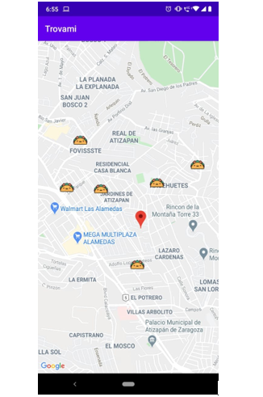

Trovami es una aplicación desarrollada en Android Studio con Java y consiste en una app que te muestra los locales de tacos cerca de tu ubicación.

Esto lo consigue a partir del gps de tu teléfono celular y con ayuda de la API de Google Maps.

